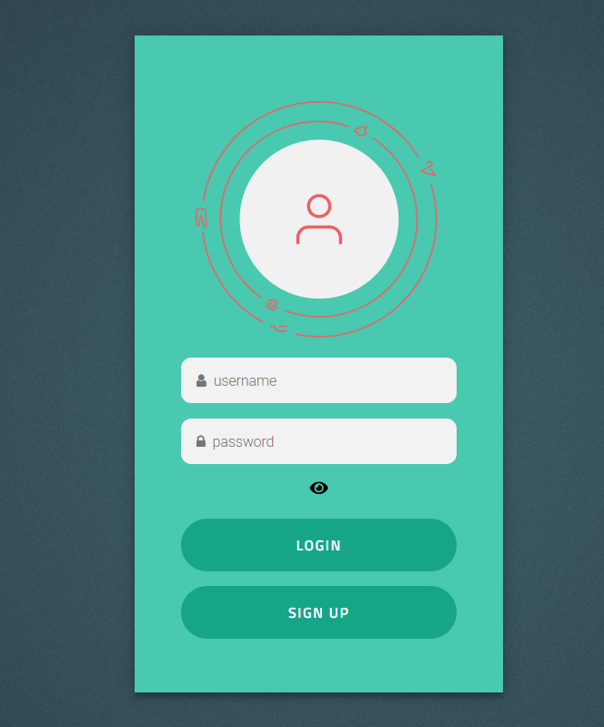
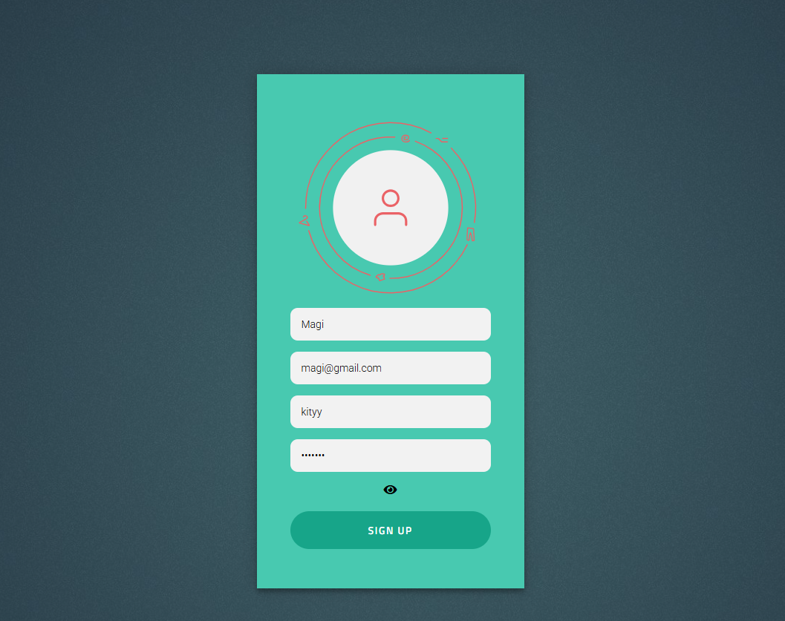

# Login-Signup Form

A simple **Login and Signup Form** built using HTML, CSS, and JavaScript. This project demonstrates basic user authentication form design and client-side validation.

## Features

- Responsive login and signup forms
- Input validation (email format, password confirmation)
- Modern and clean UI design
- Easy to integrate into any web project

## Technologies Used

- **HTML5** – Structure of the forms  
- **CSS3** – Styling and layout  
- **JavaScript** – Form validation and interactivity  

## Screenshots




## Installation

1. Clone the repository:

```bash
git clone https://github.com/YourUsername/Login-Signup-form.git
